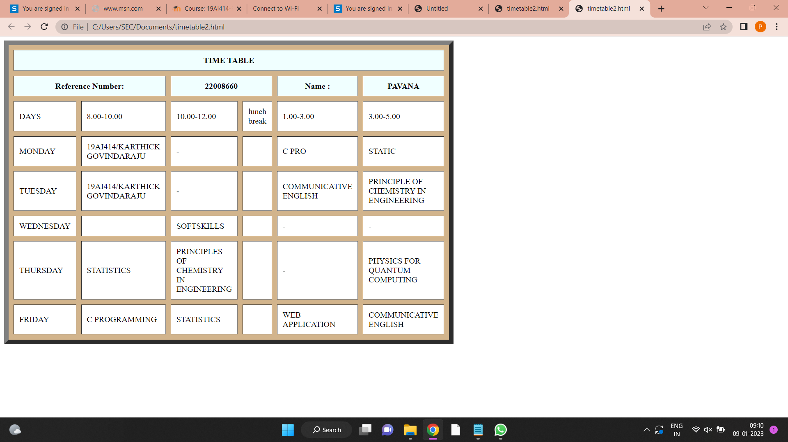

# Experiment_Time_Table

## AIM
To Write a html webpage page to display your timetable.

# ALGORITHM
### STEP 1
create a simple table using table tag
### STEP 2
Add header row using th tag
### STEP 3
Add your timetable
### STEP 4
Execute the program

# CODE 
<TABLE BORDER="9" width="750" bgcolor="tan" cellspacing="10" cellpadding="10"> 
<TR> 
	<TH colspan="7" align="center" bgcolor="azure">TIME TABLE</TH>
</TR>   
<TR> 
	<TH colspan="2" width="25%" bgcolor="azure">Reference Number:</TH>
     <TH colspan="2" width="25%" bgcolor="azure">22008660</TH>
     <TH colspan="2" width="25%" bgcolor="azure">Name:</TH>
     <TH colspan="2" width="25%" bgcolor="azure">Pavana</TH> 
</TR>
<TR>
	<TD width="25%" bgcolor="white">DAYS</TD>
      <TD width="25%" bgcolor="white">1</TD> 
	<TD width="25%" bgcolor="white">2</TD>
     <TD width="25%" bgcolor="white">lunch break</TD>
     <TD width="25%" bgcolor="white">3</TD>
     <TD width="25%" bgcolor="white">4</TD>
</TR>
<TR>
     <TD width="25%" bgcolor="white">MONDAY</TD>
     <TD width="25%" bgcolor="white">19AI414/KARTHICK GOVINDARAJU</TD>
     <TD width="25%" bgcolor="white">-</TD>
     <TD width="25%" bgcolor="white">      </TD>
     <TD width="25%" bgcolor="white">C PRO</TD>
     <TD width="25%" bgcolor="white">STATIC</TD>
</TR> 

<TR>
     <TD width="25%" bgcolor="white">TUESDAY</TD>
     <TD width="25%" bgcolor="white">19AI414/KARTHICK GOVINDARAJU</TD>
     <TD width="25%" bgcolor="white">-</TD>
     <TD width="25%" bgcolor="white">      </TD>
     <TD width="25%" bgcolor="white">COMMUNICATIVE ENGLISH</TD>
     <TD width="25%" bgcolor="white">PRINCIPLE OF CHEMISTRY IN ENGINEERING</TD>
</TR> 
<TR>
     <TD width="25%" bgcolor="white">WEDNESDAY</TD>
     <TD width="25%" bgcolor="white"PHYSICS FOR QUANTUM COMPUTING</TD>
     <TD width="25%" bgcolor="white">SOFTSKILLS</TD>
     <TD width="25%" bgcolor="white">      </TD>
     <TD width="25%" bgcolor="white">-</TD>
     <TD width="25%" bgcolor="white">-</TD>
</TR> 
<TR>
     <TD width="25%" bgcolor="white">THURSDAY</TD>
     <TD width="25%" bgcolor="white">STATISTICS</TD>
     <TD width="25%" bgcolor="white">PRINCIPLES OF CHEMISTRY IN ENGINEERING</TD>
     <TD width="25%" bgcolor="white">      </TD>
     <TD width="25%" bgcolor="white">-</TD>
     <TD width="25%" bgcolor="white">PHYSICS FOR QUANTUM COMPUTING</TD>
</TR> 
<TR>
     <TD width="25%" bgcolor="white">FRIDAY</TD>
     <TD width="25%" bgcolor="white">C PROGRAMMING</TD>
     <TD width="25%" bgcolor="white">STATISTICS</TD>
     <TD width="25%" bgcolor="white">      </TD>
     <TD width="25%" bgcolor="white">WEB APPLICATION</TD>
     <TD width="25%" bgcolor="white">COMMUNICATIVE ENGLISH</TD>
</TR> 
</TABLE>

# OUPUT
